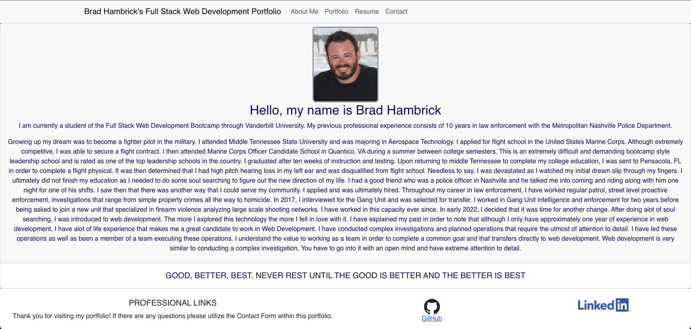
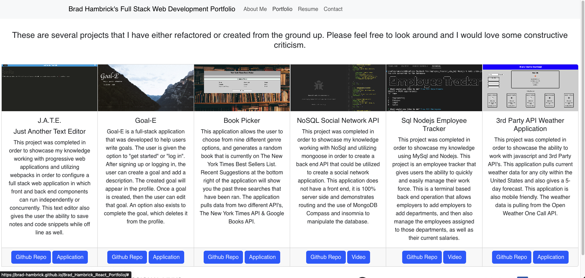
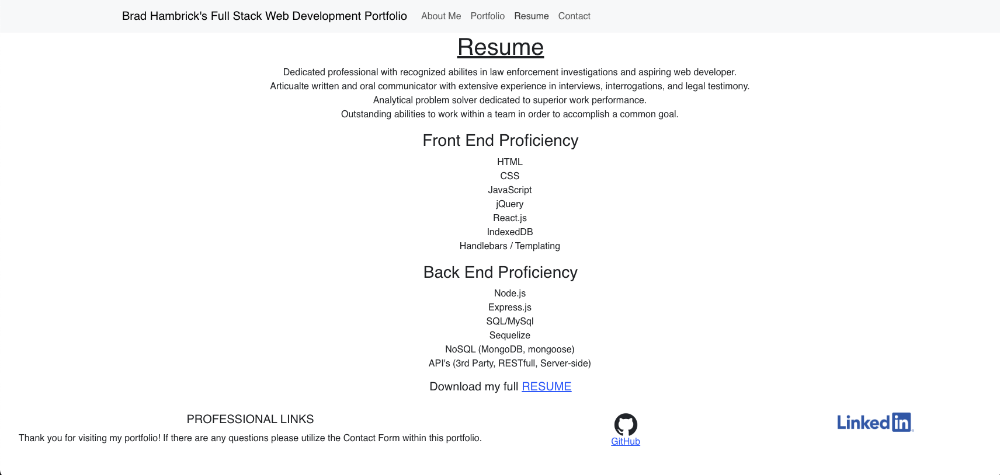
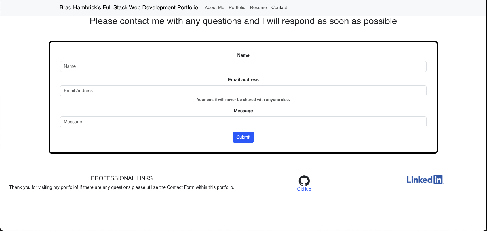

# Brad_Hambrick_React_Portfolio

Welcome to my coding portfolio that was created using React.

## GitHub Repository

[Brad_Hambrick_React_Portfolio GitHub Repository](https://github.com/Brad-Hambrick/Brad_Hambrick_React_Portfolio)

## Deployed Application

[Brad_Hambrick_React_Portfolio](https://brad-hambrick.github.io/Brad_Hambrick_React_Portfolio/)

## Description

This portfolio was completed using React and will be utilized to showcase my completed projects. This application is currently using conditional rendering, however I have code in place that can be quickly changed in order for it to be ran with either Hash router or Browser router.

## Badges

All of the coding methods in this project were those that were learned during the Vanderbilt Coding Bootcamp as well as some open source searches on React. React Bootstrap is currently the primary styling for the page and many of the components were drawn from there. Emailjs is also utilized for the contact form. There was some CSS alterations made to certain aspects and some of the application is CSS'd completely from scratch.

## Visuals

## Usage

This project was created to showcase my ability to work with React and to showcase prior completed projects.

## Support

For support, contact Brad Hambrick @bradleyhambrick@gmail.com

## Roadmap

This project is built to a point of basic functionality however could have several more features added. I plan to make several alterations and improvements to this application and utilize it for future employment applications.

## Contributing

This project is open to recommendations and future contributions.

## Authors and acknowledgment

Thanks to Vanderbilt Coding Bootcamp for contributing to the knowledge required to build this project.

## License

This project was completed using React, React Bootstrap, emailjs and many npm packages.

## Project status

The project is still in the early phases and will be getting future improvements and alterations.
